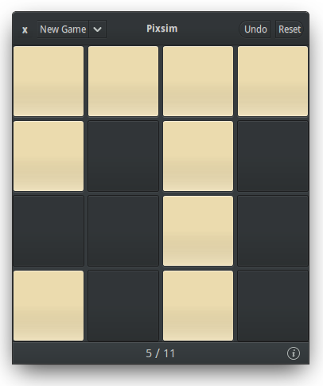

# Pixsim

A simple game for Elementary Os written in Vala and C. The objective of the game is to turn on all the lights, clicking on any square will invert the colors in a + shape. We've included 5 difficulty levels for each of the 5 board sizes, and each new game is generated randomly for endless entertainment. 

## How to install

* Download and run the make.sh script inside of the folder. The script will automatically complile and install the game for you to be able to run it from the app launcher

